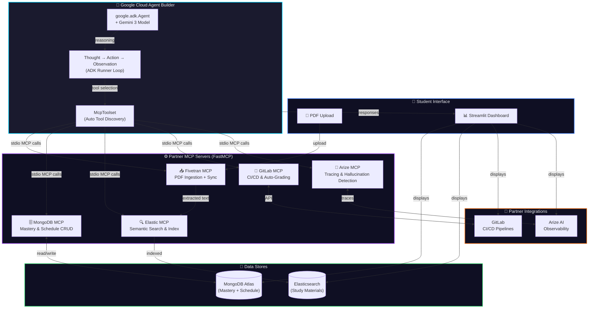
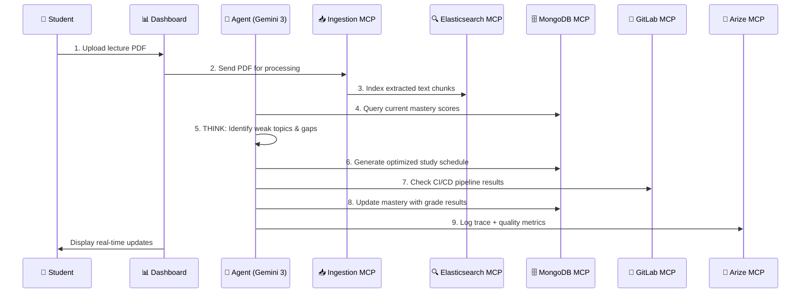

<div align="center">

# ⚡ Academic Commander

**AI-Powered Autonomous Study Agent — Built on Google Cloud Agent Builder × Gemini 3**

[](https://python.org)
[](https://streamlit.io)
[](https://cloud.google.com)
[](LICENSE)
[](https://googlecloudagentbuilder.devpost.com)

---

**Academic Commander** is an autonomous AI study agent that ingests lecture materials, tracks topic mastery, auto-generates optimized study schedules, grades code assignments via CI/CD pipelines, and monitors its own quality through real-time observability — all orchestrated through five specialized MCP servers powered by Google Gemini 3.

[🚀 Quick Start](#-quick-start) · [📖 Documentation](#-how-it-works) · [🎥 Demo](#-demo) · [🤝 Contributing](#-contributing)

</div>

---

## 📐 Architecture

The system follows a **Model Context Protocol (MCP)** architecture where the central Gemini-powered agent communicates with five specialized tool servers, each wrapping a partner-track technology:



---

## ✨ Features

| Feature | Description |
|---------|-------------|
| 📥 **PDF Ingestion** | Upload lecture notes and textbooks — the agent extracts text, chunks it, and indexes it for semantic search |
| 🎯 **Mastery Tracking** | Per-topic mastery scores stored in MongoDB, color-coded progress bars (red → yellow → green) |
| 📅 **Smart Scheduling** | AI-optimized daily study plans that adapt based on upcoming exams and weak topics |
| 🧠 **Agentic Reasoning** | Full Thought → Action → Observation trace log showing the agent's autonomous decision-making |
| 🚀 **CI/CD Auto-Grading** | GitLab pipelines automatically test and grade code assignments with detailed reports |
| 🛡️ **Quality Observability** | Arize AI integration tracks hallucination rates, latency, token usage, and response accuracy |
| 🔍 **Semantic Search** | Elasticsearch-powered search across all ingested study materials |
| 🌙 **Premium Dashboard** | Glassmorphism dark-mode UI with animations, gradients, and professional layout |

---

## 🛠️ Tech Stack

| Layer | Technology | Purpose |
|-------|-----------|---------|
| 🤖 Agent Core | Google ADK + Gemini 3 | Autonomous reasoning and tool orchestration |
| 🔧 Tool Protocol | FastMCP 2.0 | Model Context Protocol servers for tool integration |
| 🗄️ Primary Database | MongoDB Atlas | Mastery scores, schedules, student profiles |
| 🔍 Search Engine | Elasticsearch | Full-text and semantic search over study materials |
| 🦊 CI/CD | GitLab CI/CD | Automated testing and grading of code assignments |
| 📡 Observability | Arize AI | LLM tracing, hallucination detection, quality metrics |
| 📊 Dashboard | Streamlit | Real-time premium web dashboard |
| 📄 PDF Processing | PyPDF2 | Lecture note and textbook ingestion |
| 🐍 Language | Python 3.11+ | Primary development language |

---

## 📋 Prerequisites

Before you begin, ensure you have the following installed:

- **Python 3.11+** — [Download](https://www.python.org/downloads/)
- **Git** — [Download](https://git-scm.com/downloads)
- **MongoDB** — [Atlas (cloud)](https://www.mongodb.com/atlas) or [local](https://www.mongodb.com/try/download/community)
- **Elasticsearch** — [Elastic Cloud](https://www.elastic.co/cloud/) or [local](https://www.elastic.co/downloads/elasticsearch)
- **Google Cloud Account** — [Sign up](https://cloud.google.com/) with Agent Builder & Gemini API access
- **GitLab Account** — [Sign up](https://gitlab.com/) for CI/CD integration
- **Arize AI Account** — [Sign up](https://arize.com/) for observability

---

## 🚀 Quick Start

### 1. Clone the Repository

```bash
git clone https://github.com/your-username/academic-commander.git
cd academic-commander
```

### 2. Create a Virtual Environment

```bash
python -m venv venv

# Windows
venv\Scripts\activate

# macOS / Linux
source venv/bin/activate
```

### 3. Install Dependencies

```bash
pip install -r requirements.txt
```

### 4. Configure Environment Variables

```bash
cp .env.example .env
# Edit .env with your actual API keys and connection strings
```

### 5. Launch the Dashboard

```bash
streamlit run app/main.py
```

The dashboard will open at [http://localhost:8501](http://localhost:8501).

> **💡 Tip:** The dashboard works in **demo mode** even without live database connections — perfect for hackathon demos!

---

## 🔧 Running MCP Servers

Each MCP server runs independently and can be started individually:

```bash
# Start all MCP servers (each in a separate terminal)
python mcp_servers/ingestion_server.py      # Port 5001
python mcp_servers/mongodb_server.py        # Port 5002
python mcp_servers/elasticsearch_server.py  # Port 5003
python mcp_servers/gitlab_server.py         # Port 5004
python mcp_servers/arize_server.py          # Port 5005
```

Or use the orchestrator:

```bash
python run_all_servers.py
```

---

## 📊 Running the Dashboard

```bash
# Standard launch
streamlit run app/main.py

# With custom port
streamlit run app/main.py --server.port 8080

# With auto-reload on file changes
streamlit run app/main.py --server.runOnSave true
```

---

## 🤖 Running the Agent

The agent is built with **Google Cloud Agent Builder (ADK)** using the `Agent` class
and `McpToolset` for native MCP server integration. Gemini 3 handles all reasoning
and automatically discovers + invokes tools from each MCP server.

```bash
# Run the agent with a syllabus PDF (triggers full 9-step cycle)
python -m agent.orchestration --file ingestion/syllabus.pdf

# Send a free-form message to the agent
python -m agent.orchestration --message "Show my mastery scores and schedule"

# Run with verbose logging
python -m agent.orchestration --log-level DEBUG
```

---

## 📁 Project Structure

```
academic-commander/
├── 📂 agent/                    # Google ADK Agent (Agent Builder)
│   ├── __init__.py              # Package exports
│   ├── config.py                # Config + MCP server descriptors
│   ├── orchestration.py         # ADK Agent + McpToolset + Runner
│   └── prompts.py               # Gemini 3 prompt templates
├── 📂 app/                      # Streamlit dashboard
│   └── main.py                  # Premium dark-mode dashboard
├── 📂 ingestion/                # PDF upload staging directory
│   └── .gitkeep
├── 📂 mcp_servers/              # FastMCP partner tool servers
│   ├── fivetran_mcp.py          # Fivetran: PDF ingestion + sync
│   ├── elastic_mcp.py           # Elastic: Semantic search + indexing
│   ├── mongodb_mcp.py           # MongoDB: Mastery & schedule CRUD
│   ├── gitlab_mcp.py            # GitLab: CI/CD + code sandboxes
│   └── arize_mcp.py             # Arize AI: Observability + tracing
├── 📂 tests/                    # Test suite
│   └── test_homework.py         # Automated grading tests (pytest)
├── .env.example                 # Environment variable template
├── .gitignore                   # Git ignore rules
├── .gitlab-ci.yml               # CI/CD pipeline config
├── LICENSE                      # MIT License
├── README.md                    # This file
└── requirements.txt             # Python dependencies
```

---

## 🤝 Partner Track Integrations

Academic Commander integrates five hackathon partner technologies:

### 1. 🗄️ MongoDB Atlas — Knowledge Persistence

Stores mastery scores, study schedules, and student profiles as flexible JSON documents. The MCP server provides CRUD tools for the agent to read and update learning progress in real time.

### 2. 🔍 Elasticsearch — Semantic Study Search

All ingested study materials are indexed in Elasticsearch with chunked embeddings. The agent performs semantic search to find relevant content when answering questions or generating practice sets.

### 3. 🦊 GitLab CI/CD — Automated Code Grading

Student code assignments are automatically tested and graded through GitLab CI/CD pipelines. The agent monitors pipeline status and integrates test results into the mastery matrix.

### 4. 📡 Arize AI — Agent Observability

Every agent trace (Thought → Action → Observation) is logged to Arize AI. The dashboard displays real-time hallucination scores, response accuracy, token usage, and latency metrics.

### 5. 📥 PyPDF2 — Document Ingestion

Lecture PDFs are parsed, chunked, and converted to searchable text. The ingestion MCP server handles document processing and feeds content into Elasticsearch.

---

## ⚙️ How It Works

The agent follows a **9-step autonomous workflow**:



| Step | Action | MCP Server |
|------|--------|------------|
| 1 | Student uploads a lecture PDF via the dashboard | — |
| 2 | PDF sent to the Ingestion MCP server for text extraction | `ingestion_server` |
| 3 | Extracted text chunks indexed in Elasticsearch | `elasticsearch_server` |
| 4 | Agent queries MongoDB for current mastery scores | `mongodb_server` |
| 5 | Agent **thinks**: identifies weak topics, prerequisite gaps | Gemini 3 (internal) |
| 6 | Agent generates an optimized daily study schedule | `mongodb_server` |
| 7 | Agent checks GitLab CI/CD for assignment test results | `gitlab_server` |
| 8 | Agent updates mastery scores based on grades | `mongodb_server` |
| 9 | Full trace logged to Arize AI for quality monitoring | `arize_server` |

---

## 🎥 Demo

> 🎬 **Demo video coming soon!**
>
> A walkthrough video showcasing the full Academic Commander workflow — from PDF upload to autonomous study scheduling — will be available here.

<!-- Replace with actual demo video link -->
<!-- [](https://youtu.be/VIDEO_ID) -->

**Screenshots:**

| Dashboard Overview | Mastery Matrix | Agent Trace Log |
|:-:|:-:|:-:|
| *Coming soon* | *Coming soon* | *Coming soon* |

---

## 🧪 Testing

```bash
# Run all tests
python -m pytest tests/ -v

# Run with coverage
python -m pytest tests/ --cov=. --cov-report=html

# Run only unit tests
python -m pytest tests/ -v -k "not integration"
```

---

## 🤝 Contributing

We welcome contributions! Here's how to get started:

1. **Fork** the repository
2. **Create** a feature branch (`git checkout -b feature/amazing-feature`)
3. **Commit** your changes (`git commit -m 'Add amazing feature'`)
4. **Push** to the branch (`git push origin feature/amazing-feature`)
5. **Open** a Pull Request

Please read our code of conduct and ensure your contributions align with the project's architecture.

---

## 📜 License

This project is licensed under the **MIT License** — see the [LICENSE](LICENSE) file for details.

---

## 🙏 Acknowledgments

- **[Google Cloud](https://cloud.google.com/)** — Agent Builder platform and Gemini 3 API
- **[Google ADK](https://google.github.io/adk-docs/)** — Agent Development Kit for autonomous agents
- **[MongoDB](https://www.mongodb.com/)** — Flexible document database for knowledge persistence
- **[Elasticsearch](https://www.elastic.co/)** — Powerful search and analytics engine
- **[GitLab](https://gitlab.com/)** — CI/CD pipelines for automated grading
- **[Arize AI](https://arize.com/)** — LLM observability and hallucination detection
- **[Streamlit](https://streamlit.io/)** — Beautiful data app framework
- **Rapid Agent Hackathon 2026** — For pushing the boundaries of AI agent development

---

<div align="center">

**Built with ⚡ for the Google Cloud Rapid Agent Hackathon 2026**

*Academic Commander — Because studying should be intelligent.*

</div>
